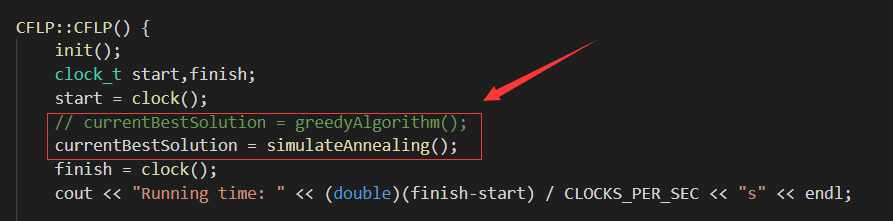

# 算法设计与分析期末项目

---
Author: Liang Junhua
Number: 16340129
Email: liangjh45@mail2.sysu.edu.cn

---
## 编译说明
如果希望能够重新将所有文件编译运行一遍，可以打开cmd，在当前目录下执行：
```
g++ facility.h -std=c++11 -c
g++ facility.cpp -std=c++11 -c
g++ main.cpp -std=c++11 -c
g++ main.o facility.o -o main
```
程序运行的环境为Windows10操作系统，MinGW64编译

---
## 文件目录
- Instances中存放的是71种实验测例
- Greedy中存放的是贪心算法的测试结果
- SA中存放的是模拟退火算法的测试结果
如果要测试某个单独的文件，可以输入如下指令（以p1为例）：
```
main < ./Instances/p1 > out.txt
```
如果希望批处理，可以输入如下命令：
```
a.bat
```
需要注意的是，如果要测试不同算法，在批处理前需要重新将文件编译一遍，且在facility.cpp中修改下面代码：
